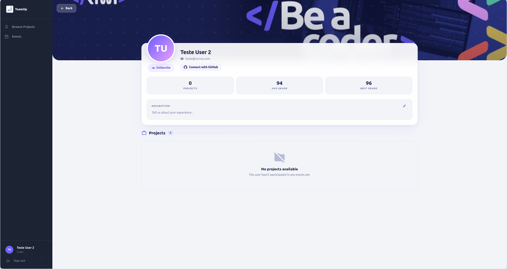
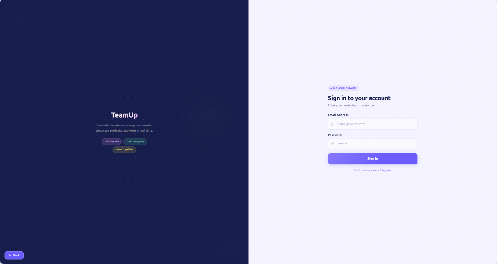

# 02 — Registration and Access

## 1. Coder Registration

Access to TeamUp begins with creating an account. The platform has a **registration page exclusively for coders**, where the information needed to identify the participant within RIWI is collected.


### 1.1 Required registration fields

| Field | Type | Description |
|-------|------|-------------|
| **Full name** | Text | Coder's first and last name |
| **Identity document** | Number | Participant ID or official document |
| **Clan** | Selection | RIWI clan the coder belongs to |
| **Email address** | Email | Used as the login identifier |
| **Password** | Password | Minimum character requirements; used for authentication |

> **Note:** Coder registration is the only self-registration flow available on the platform. Roles `ADMIN`, `TL_DEVELOPMENT`, `TL_SOFT_SKILLS`, and `TL_ENGLISH` are assigned directly by the system administrator.

### 1.2 Registration flow

```
Registration Page
       │
       ▼
Complete form
(Name, Document, Clan, Email, Password)
       │
       ▼
Are the fields valid?
   /          \
 YES          NO
  │            │
  ▼            ▼
Account     Error messages
created    for invalid fields 
  │
  ▼
Redirect to Login
```

---

## 2. GitHub Account Linking

After creating the account,in the profile section, the user must link their GitHub account. This step is essential for the automatic integration with team repositories.


### 2.1 Why linking GitHub is necessary

When a coder joins a team for an event, TeamUp adds them automatically as a **collaborator** on the team's GitHub repository. To do that, the platform needs to know the coder's GitHub username and has permission to add them as a collaborator. 

### 2.2 Linking flow

```
User Profile
       │
       ▼
GitHub Linking section
       │
       ▼
Click "Connect with GitHub"
       │
       ▼
Redirect to GitHub OAuth
(Authorize TeamUp permissions)
       │
       ▼
Is authorization granted?
   /          \
 YES         NO
  │            │
  ▼            ▼
GitHub linked    Linking canceled
                    (can try again later)
```

### 2.3 GitHub linking states

| State | Visual indicator | Impact |
|--------|------------------|--------|
| **Linked** | GitHub username visible in profile | Can join teams and be added as collaborator |
| **Not linked** | "Connect with GitHub" button is visible in profile | Can not join teams or create teams |

>  **Important:** It is very important to link GitHub **before joining an event** so the coder can access the team repository immediately.

---

## 3. Login

Login is the common entry point for **all roles** on the platform.



### 3.1 Required fields

| Field | Description |
|-------|-------------|
| **Email address** | The same email used during registration |
| **Password** | The password defined during registration |

### 3.2 Login flow

```
Login Screen
       │
       ▼
Enter email and password
       │
       ▼
   [ Sign In ]
       │
       ▼
Are the credentials valid?
   /              \
 YES               NO
  │                  │
  ▼                  ▼
Identify user role   Show message:
from the account    "Email or password is incorrect"
  │
  ├── ADMIN        → Redirect to Events panel
  ├── CODER        → Redirect to Home page
  ├── TL_DEVELOPMENT → Redirect to TL panel
  ├── TL_SOFT_SKILLS → Redirect to TL panel
  └── TL_ENGLISH   → Redirect to TL panel
```

### 3.3 Security considerations

- Passwords are stored securely (hash + salt).
- The session remains active until the user logs out manually.
- There is currently no password recovery flow (to be implemented).

---

## 4. Onboarding Summary

```
New user (Coder)
       │
       ▼
  1. Register ──────────────────────────────────────────┐
     Complete personal and RIWI information              │
       │                                                │
       ▼                                                │
  2. Link GitHub (from Profile)                         │
     Authorize TeamUp in GitHub OAuth                    │
       │                                                │
       ▼                                                │
  3. Login                                              │
     Enter email and password                            │
       │                                                │
       ▼                                                │
  4. Explore events ────────────────────────────────── ┘
     View available events and join one
```

---

[← Previous: Introduction](./introduction.md) | [← Back to index](./contents.md)
