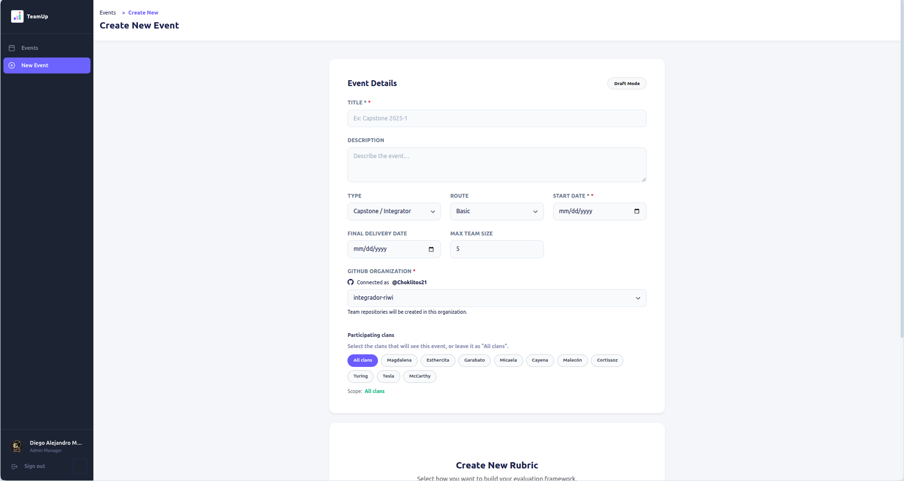
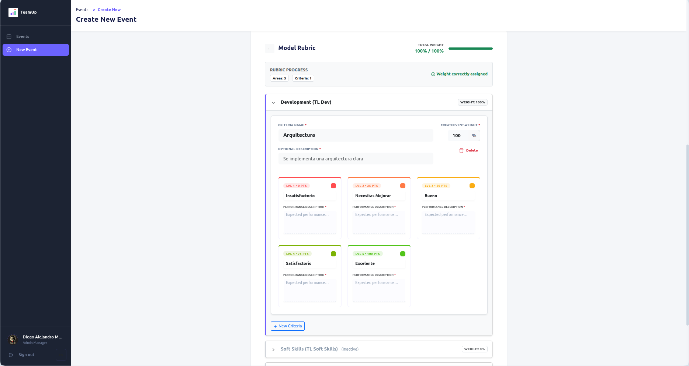
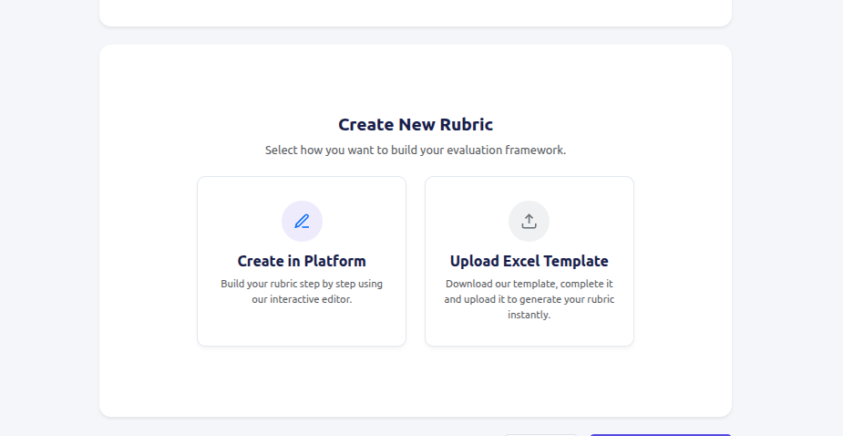
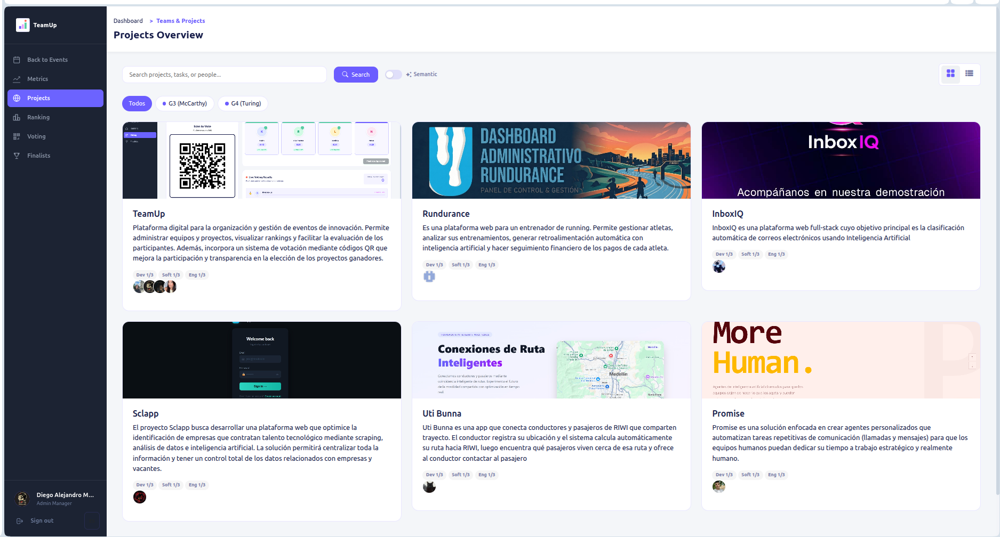
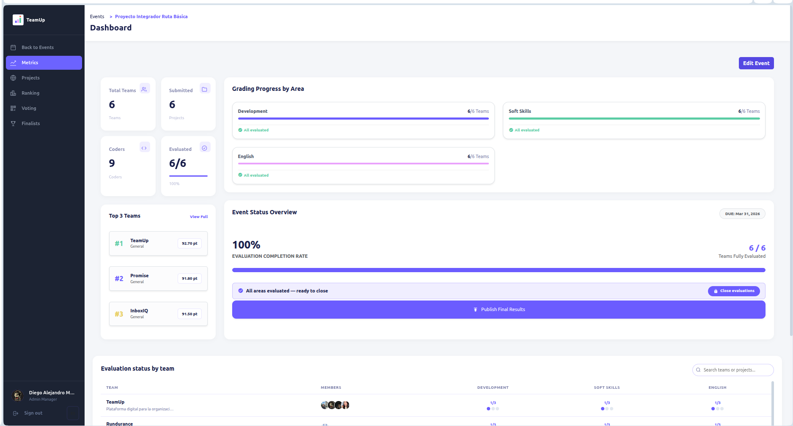
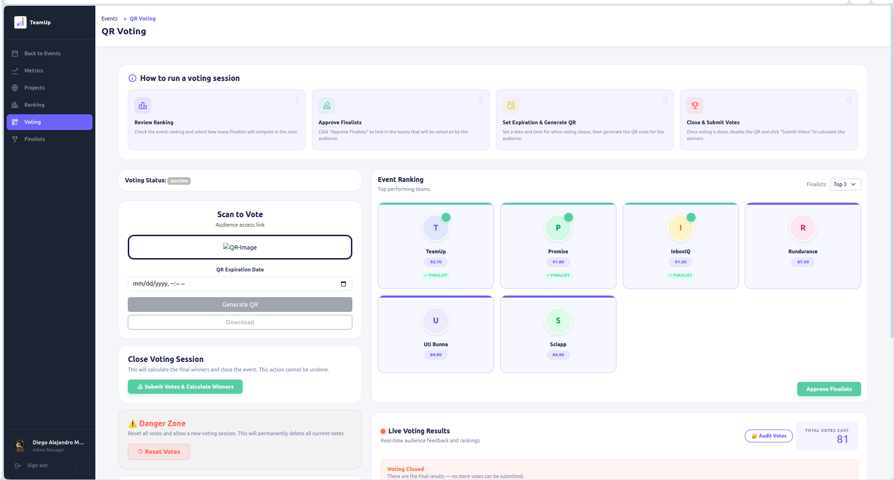
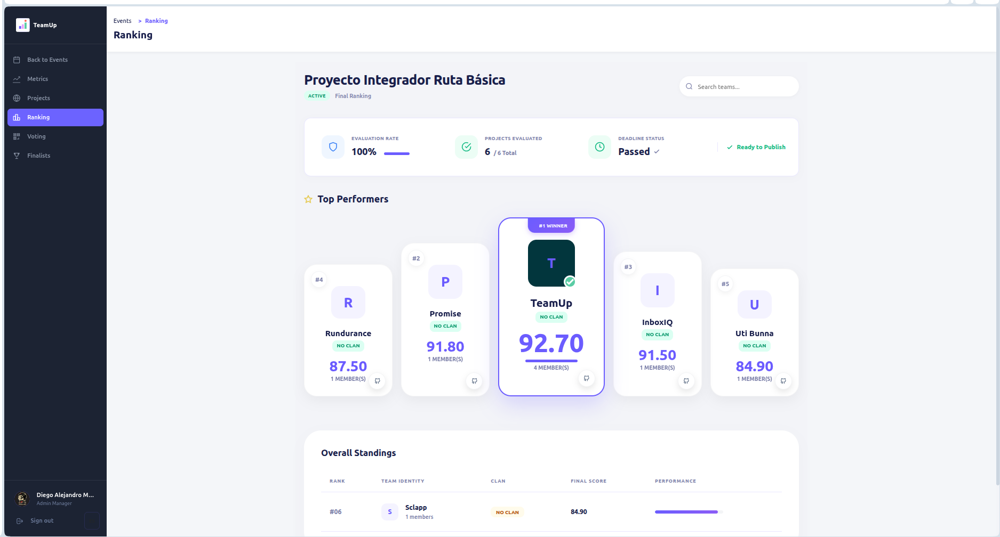
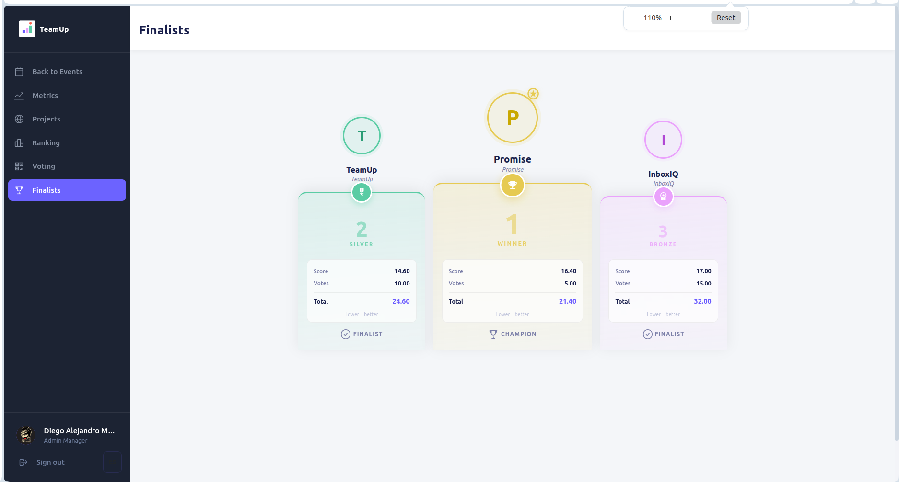

# 03 — Rol Administrador (ADMIN)

El rol de **Administrador (`ADMIN`)** tiene el control total sobre la plataforma TeamUp. Es el encargado de orquestar los eventos, configurar las métricas de calificación y monitorear el progreso general del hackathon o evento de programación.

## 1. Gestión de Eventos

El administrador es el único capaz de crear y gestionar los eventos principales de la plataforma.
- **Creación de eventos**: Define el nombre, la descripción, fecha de inicio y fin, y las reglas generales.
- **Estado del evento**: Puede cambiar el estado del evento (Ej. Activo, Finalizado, En Evaluación).

## 2. Configuración de Rúbricas y Evaluaciones

Antes de que los Tech Leads puedan calificar, el Admin debe configurar cómo se evaluará el evento.
- Establece los pesos y criterios para las tres áreas principales: **Desarrollo (DEV)**, **Habilidades Blandas (SOFT SKILLS)** e **Inglés (ENGLISH)**.
- Define qué porcentaje del puntaje total dependerá de los votos del público (QR-Votes).

Nuestra plataforma cuenta con dos maneras de realizar la creacion de la rubrica. Se puede hacer directamente desde la plataforma con el rubric builder que va mostrando los pesos, descripciones y ejemplos de cada criterio por area(una rubrica puede tener un area o varias, segun la necesidad del evento), o se puede descargar la plantilla que tenemos estandarizada en un archivo excel, donde se modifican los pesos, descripciones y ejemplos de cada criterio por area y se sube el archivo a la plataforma para que se cree la rubrica automaticamente.

## 3. Monitoreo de Equipos y Participantes

El administrador tiene acceso a una vista global de todos los `coders` y los equipos formados.

El admin tambien tiene un dashboard para monitorear el progreso general del evento, incluyendo calificaciones, mejor puntuacion, entregas, etc. Dentro del dashboard tiene la opcion de finalizar el evento y publicar los resultados finales(lo que cerraria la entrega de proyectos y comenzaria a habilitar la votacion publica)

## 4. Live Voting (Votos QR) y Finalistas

Durante la etapa final del evento, el Admin controla la votación del público y la generación del ranking.
- **Generación de QR**: Puede generar o habilitar el código QR para que el público vote por su proyecto favorito.

- **Cálculo del Ranking**: El sistema suma automáticamente las calificaciones de los Tech Leads, los 5 proyectos con mayor puntuacion pasarian a ser finalistas y son los que estarian disponibles en la votacion publica.

- **Podio de Finalistas**: El Admin visualiza en tiempo real a los ganadores (Finalistas) y puede dar por concluido el evento.

---
[← Anterior: Registro y Acceso](./access-and-register.md) | [Siguiente: Rol Tech Lead →](./tech-lead.md)
