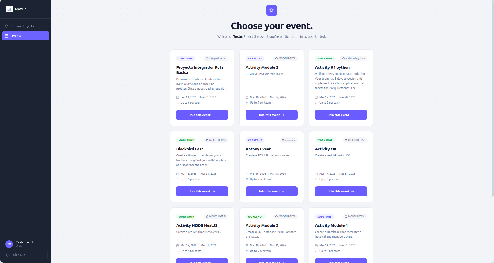
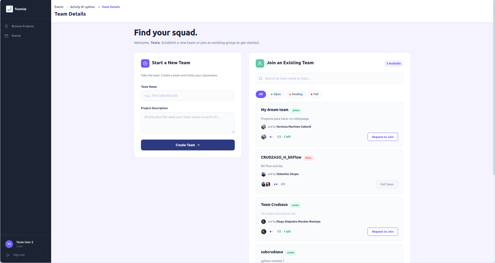
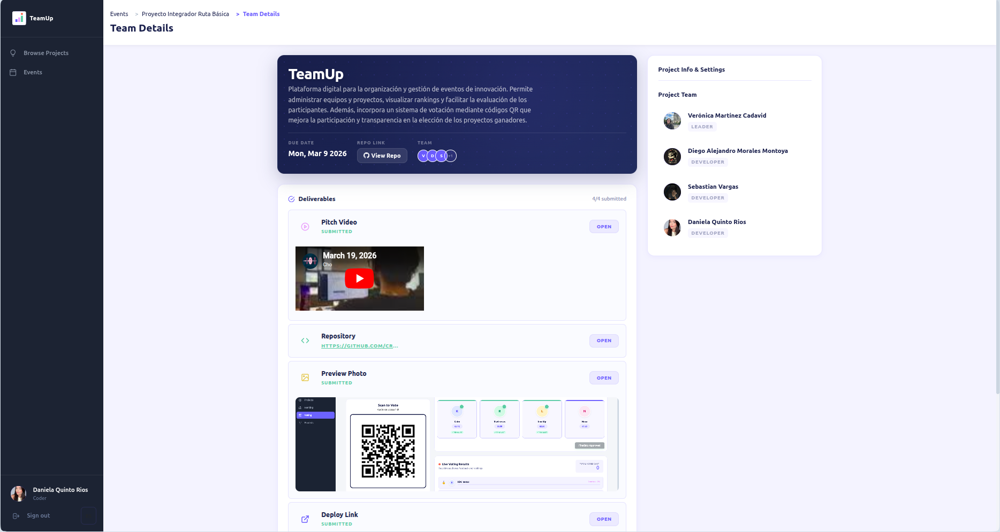

# 05 — Coder Role

The **Coder** role is the primary profile for event participants. From their dashboard, they can view available events, join a team, and submit their final project.

## 1. Event Exploration

Once the Coder has logged in, they can see the list of **active events**.
- They can access event details to learn about the rules, dates, and requirements.

## 2. Team Creation and Management

The core dynamic of TeamUp revolves around teams.
- **Create a team**: A Coder can found a team and become its leader.
- **Join a team**: Can join teams that are looking for members.
- **Automatic Repository**: Once the team is consolidated, the TeamUp system communicates with GitHub Organizations to **automatically create a repository** and invite all members (Coders) as collaborators instantly.

## 3. Project Development and Submission

During the event, the team works on their GitHub repository. Upon completion, the Coder in charge must **submit the project** through the platform.
- **Space for deliverable resources**: Allows attaching the repository link, deployment URLs, and uploading necessary files or images.
- **Submission Confirmation**: Once submitted, when the event reaches its closing date, the team's status changes to "Submitted" and enables the Tech Leads to start their evaluation.

---
[← Previous: Tech Lead Role](./tech-lead.md) | [← Back to index](./contents.md)
