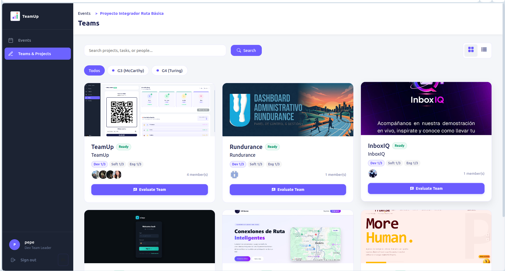
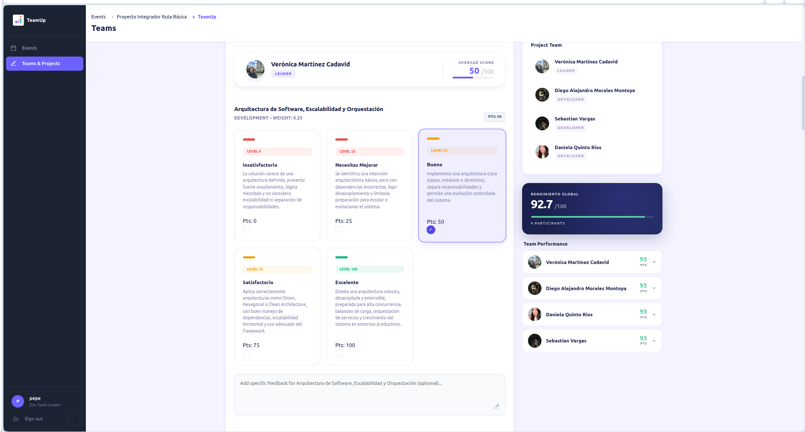
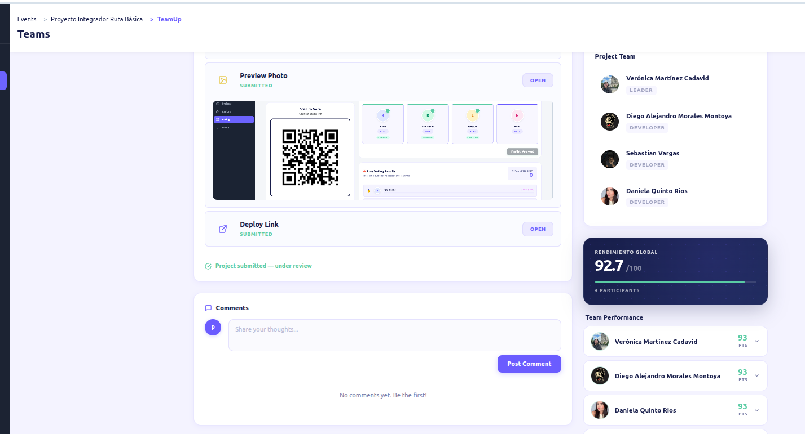

# 04 — Tech Lead Role (TL)

In TeamUp, **Tech Leads (TL)** are the judges or evaluators of the projects submitted by the Coders. There are three sub-roles of TL, but all share the same functional flow on the platform, focusing on different criteria depending on their specialty:

1. **`TL_DEVELOPMENT`**: Evaluates architecture, code, and technical functionality.
2. **`TL_SOFT_SKILLS`**: Evaluates presentation, teamwork, and communication.
3. **`TL_ENGLISH`**: Evaluates English proficiency during presentations.

## 1. Evaluation Dashboard (TL Dashboard)

Upon logging in, the Tech Lead is redirected to their evaluation panel, where they will see a list of all teams and projects associated with the active event.

- **Submitted Projects**: They can only evaluate projects that have already been submitted by the teams.
- **Grading Status**: They can see which teams they have already graded and which are left to evaluate.

## 2. Rubric Grading Process

The TL's main function is to evaluate the project using the rubrics preconfigured by the Administrator.

- **Criteria Selection**: A form is displayed with the specific grading items for their area (Development, Soft Skills, or English).
- **Score Assignment**: The TL assigns a grade or selects the team's compliance level for each criterion.
- **Automatic Calculation**: The awarded score is sent to the central system (Backend) to update the `Ranking` in real time.

## 3. Comments and Feedback

Along with the numerical grade, Tech Leads can leave specific **comments (`comments`)** for each team.
- This feedback helps Coders understand their strengths and areas for improvement.
- Comments are directly associated with the evaluated project.

## 4. Real-Time Updates

Thanks to the integration with WebSockets, TLs can view updates to project statuses dynamically (for example, if a team has just submitted their repository or if another TL has finished their evaluation).

---
[← Previous: Admin Role](./admin.md) | [Next: Coder Role →](./coder.md)
