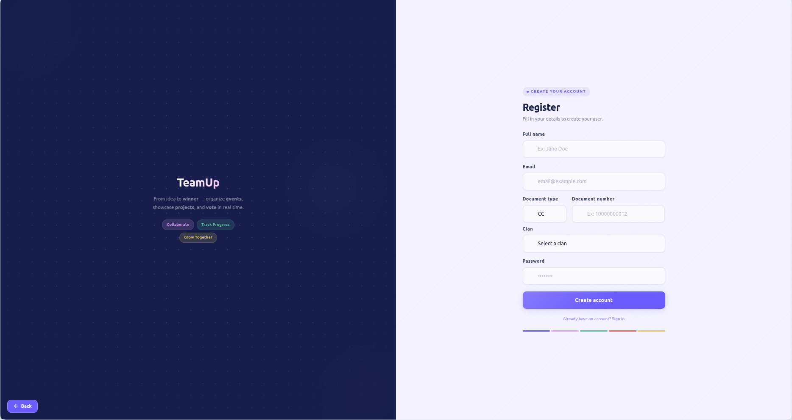

# 02 — Registro y Acceso

## 1. Registro de Coders

El acceso a TeamUp comienza con la creación de una cuenta. La plataforma cuenta con una **página de registro exclusiva para coders**, donde se recopila la información necesaria para identificar al participante dentro de RIWI.


### 1.1 Datos Requeridos en el Registro

| Campo | Tipo | Descripción |
|-------|------|-------------|
| **Nombre completo** | Texto | Nombre y apellido del coder |
| **Documento de identidad** | Número | Cédula o documento oficial del participante |
| **Clan** | Selección | Clan de RIWI al que pertenece el coder |
| **Correo electrónico** | Email | Se usará como identificador de inicio de sesión |
| **Contraseña** | Password | Mínimo de caracteres requeridos; se usa para autenticación |

> **Nota:** El registro de coders es el único proceso de auto-registro disponible en la plataforma. Los roles `ADMIN`, `TL_DEVELOPMENT`, `TL_SOFT_SKILLS` y `TL_ENGLISH` son asignados directamente por el administrador del sistema.

### 1.2 Flujo de Registro

```
Página de Registro
       │
       ▼
 Completar formulario
 (Nombre, Documento, Clan, Email, Contraseña)
       │
       ▼
  ¿Datos válidos?
   /          \
 SÍ            NO
  │             │
  ▼             ▼
Cuenta        Mensajes de
creada ✅     error por campo ❌
  │
  ▼
Redirige al Login
(o directamente al perfil para
 completar la vinculación de GitHub)
```

---

## 2. Vinculación de Cuenta de GitHub

Una vez creada la cuenta, el sistema solicitará al coder que **vincule su cuenta de GitHub** desde su perfil. Este paso es fundamental para la integración automática con los repositorios de los equipos.

### 2.1 ¿Por qué es necesario vincular GitHub?

Cuando un coder forma parte de un equipo en un evento, TeamUp lo agrega automáticamente como **colaborador** al repositorio de GitHub del equipo. Para poder hacer esto, la plataforma necesita conocer el nombre de usuario de GitHub del coder.

### 2.2 Flujo de Vinculación

```
Perfil del Usuario
       │
       ▼
Sección "Vincular GitHub"
       │
       ▼
Clic en "Conectar con GitHub"
       │
       ▼
Redirección a GitHub OAuth
(Autorización de permisos a TeamUp)
       │
       ▼
  ¿Autorizado?
   /          \
 SÍ            NO
  │             │
  ▼             ▼
GitHub vinculado ✅    Vinculación cancelada
                       (puede intentarlo de nuevo)
```

### 2.3 Estados de Vinculación de GitHub

| Estado | Indicador Visual | Implicación |
|--------|-----------------|-------------|
| **Vinculado** | ✅ Usuario de GitHub visible en perfil | Puede unirse a equipos y ser añadido como colaborador |
| **No vinculado** | ⚠️ Advertencia en perfil | Puede unirse a eventos, pero no será añadido al repositorio automáticamente |

> ⚠️ **Importante:** Se recomienda vincular GitHub **antes de unirse a un evento** para garantizar el acceso inmediato al repositorio del equipo.

---

## 3. Inicio de Sesión

El inicio de sesión es el punto de entrada común para **todos los roles** de la plataforma.

### 3.1 Datos Requeridos

| Campo | Descripción |
|-------|-------------|
| **Correo electrónico** | El mismo registrado al crear la cuenta |
| **Contraseña** | La contraseña definida durante el registro |

### 3.2 Flujo de Login

```
Pantalla de Login
       │
       ▼
Ingresar email y contraseña
       │
       ▼
   [ Iniciar Sesión ]
       │
       ▼
 ¿Credenciales válidas?
   /              \
 SÍ                NO
  │                 │
  ▼                 ▼
Identificar rol   Mostrar mensaje:
del usuario       "Correo o contraseña incorrectos"
  │
  ├── ADMIN        → Redirige a Panel de Eventos
  ├── CODER        → Redirige a Página Principal
  ├── TL_DEVELOPMENT → Redirige a Panel TL
  ├── TL_SOFT_SKILLS → Redirige a Panel TL
  └── TL_ENGLISH   → Redirige a Panel TL
```

### 3.3 Consideraciones de Seguridad

- Las contraseñas se almacenan de forma segura (hash + salt).
- La sesión se mantiene activa hasta que el usuario cierre sesión manualmente.
- No existe actualmente un flujo de recuperación de contraseña (por implementar).

---

## 4. Resumen Visual del Proceso de Onboarding

```
Nuevo usuario (Coder)
       │
       ▼
  1. Registro ──────────────────────────────────────────┐
     Completar datos personales y de RIWI               │
       │                                                │
       ▼                                                │
  2. Vinculación de GitHub (desde Perfil)               │
     Autorizar a TeamUp en GitHub OAuth                 │ Flujo
       │                                                │ de
       ▼                                                │ Onboarding
  3. Login                                              │
     Ingresar con email y contraseña                    │
       │                                                │
       ▼                                                │
  4. Explorar Eventos ────────────────────────────────── ┘
     Ver eventos disponibles y participar
```

---

[← Anterior: Introducción](./introduction.md) | [← Volver al índice](./contents.md)
